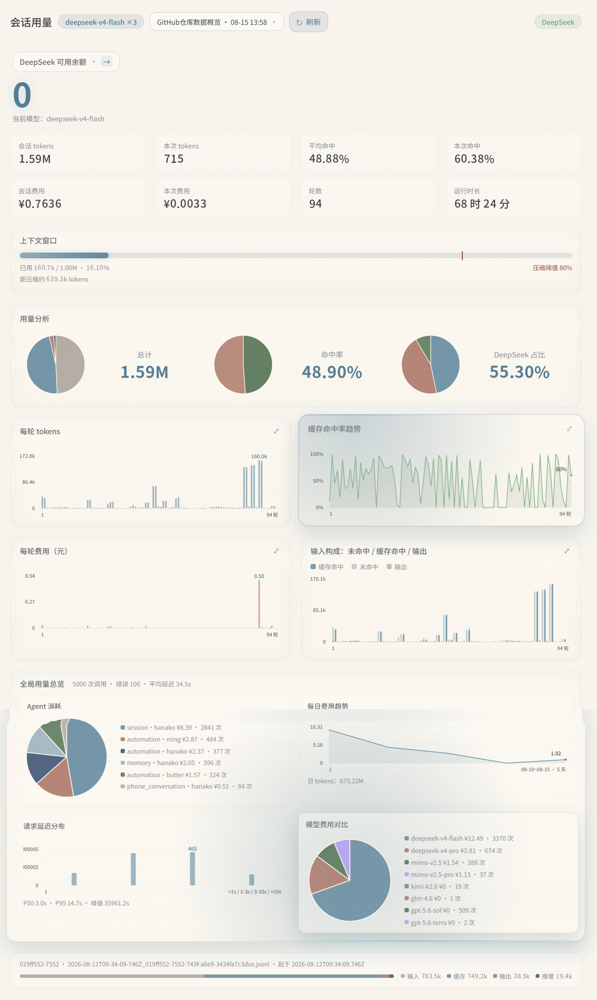
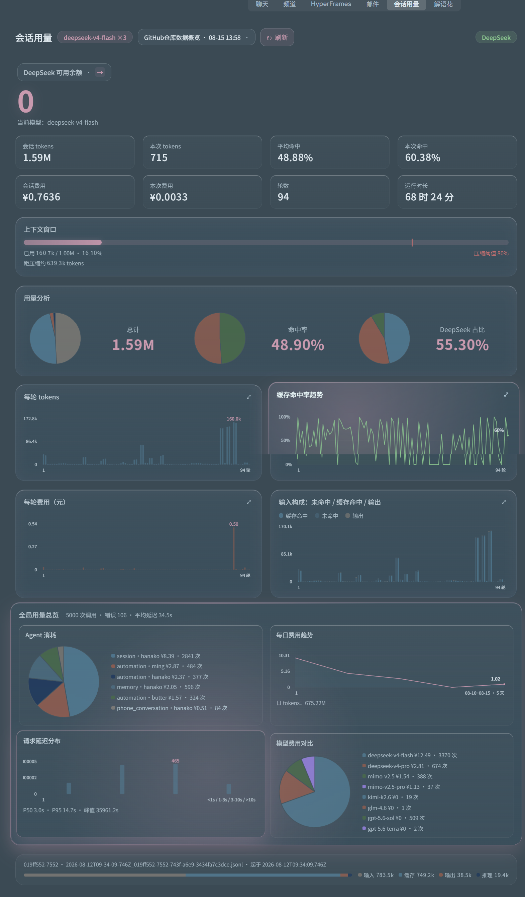
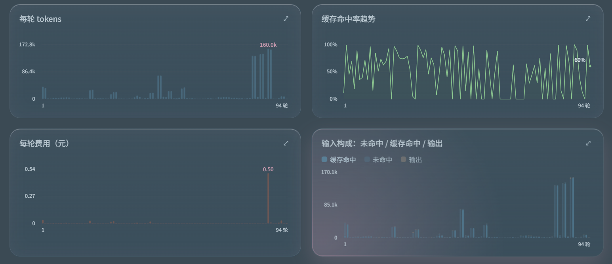
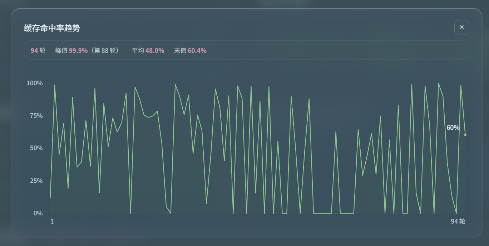
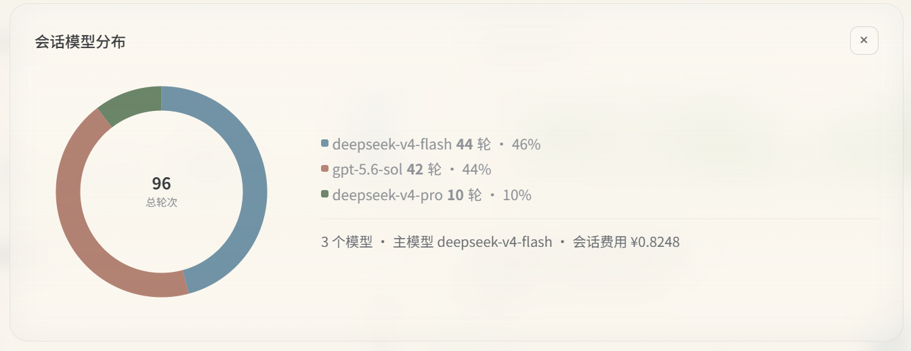
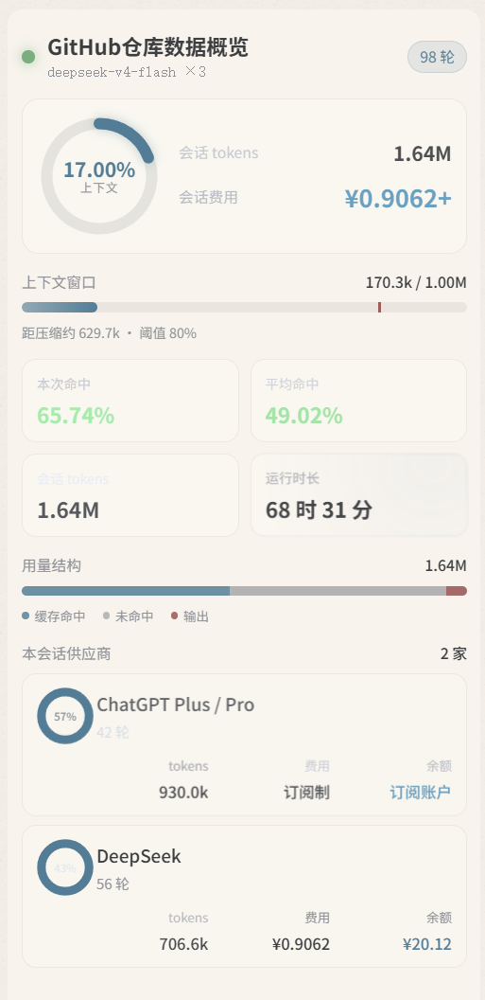
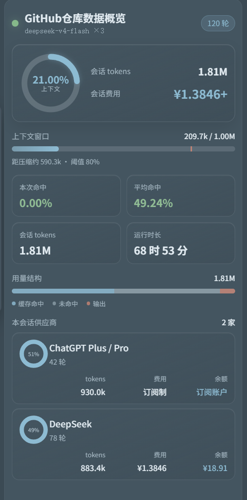

<div align="center">

# Session Insight

### 把 HanaAgent 的 Token、缓存、费用和供应商余额放进一张面板

无需上传会话内容。插件在本机读取 HanaAgent 会话记录，按轮次还原 Token 使用、缓存命中和模型费用，并提供常驻状态条与完整分析页。

[](https://github.com/youyongdemao/HanaAgent-session-insight/releases/latest)
[](./LICENSE)
[](https://github.com/liliMozi/openhanako)

[下载最新版](https://github.com/youyongdemao/HanaAgent-session-insight/releases/latest) · [安装说明](#安装) · [指标口径](#指标口径)

</div>

## 界面一览

<p align="center">
  
  
</p>

完整分析页覆盖会话指标、余额、上下文占用、用量分析与全局用量总览。深色与浅色主题自动跟随 HanaAgent 的明暗模式切换。

## 图表分析

<p align="center"></p>

每轮 Token、缓存命中率趋势、每轮费用、输入构成四类图表同屏对比，每个数据点对应一次模型调用。

## 点开卡片查看详情

点击图表卡片可放大查看单指标走势，会话模型分布也有独立详情视图。

<p align="center"></p>

<p align="center"></p>

## 常驻状态条

<p align="center">
  
  
</p>

widget 适合挂在 HanaAgent 侧边栏。无需打开完整面板，也能查看当前模型、上下文占用、Token、费用和命中率。

## 它能看什么

- 会话级用量指标：总 Token、本轮 Token、轮数与运行时长
- 上下文窗口占用：环形占比与进度条双重展示
- 缓存命中率、输入构成（未命中 / 缓存命中 / 输出）
- 按每轮实际模型价格累计的会话费用与全局消费
- DeepSeek、Moonshot 的可用余额，以及其他供应商不支持余额查询的原因
- 混用模型会话的模型分布、主模型归属与逐轮费用
- 全局用量总览：Agent 消耗、每日费用趋势、请求延迟分布、模型费用对比
- 可点击放大的图表卡片与模型分布详情

## 安装

### 从 Release 安装

1. 打开 [Releases](https://github.com/youyongdemao/HanaAgent-session-insight/releases/latest)，下载最新版 `session-insight-*.zip`
2. 解压后，将插件文件夹放入 HanaAgent 用户插件目录，或在 HanaAgent 的插件页面导入该文件夹
3. 刷新插件列表并启用 **Session Insight**
4. 从侧边栏打开 **会话用量**，或挂载 **用量状态条** widget

> 更新插件前建议保留旧版本文件夹。若 HanaAgent 提示版本或权限不兼容，请先检查下方的兼容性与权限说明。

## 配置

| 配置项 | 用途 | 默认值 |
| --- | --- | --- |
| `sessionsDir` | HanaAgent 会话 JSONL 所在目录 | `agents/<agent>/sessions` |
| `deepseekApiKey` | 查询 DeepSeek 余额；留空时尝试读取 HanaAgent 供应商配置 | 空 |
| `refreshSeconds` | widget 自动刷新间隔 | `30` 秒 |

## 指标口径

| 指标 | 计算方式 |
| --- | --- |
| 会话 Token | 会话内输入、缓存读取、缓存写入和输出 Token 的累计值 |
| 本轮 Token | 最近一次模型调用产生的各类 Token 合计 |
| 缓存命中率 | 缓存读取 Token ÷ 输入侧 Token 总量 |
| 会话费用 | 按每轮实际模型及其价格累计，不以主模型统一估算 |
| 上下文占用 | 最近一轮上下文 Token ÷ 当前模型上下文窗口 |
| 总消费 | 本机可读取会话的估算费用总和 |

费用来自本地统计和模型价格配置，适合趋势分析与用量排查。供应商账单仍应作为最终结算依据。

## 数据与隐私

- 会话统计在本机完成，插件不会把会话正文上传到第三方
- 余额查询只访问对应供应商的官方接口
- API Key 可留空；插件会尝试读取 HanaAgent 已配置的供应商凭据
- 插件需要读取会话目录，因此清单中的信任级别为 `full-access`

当前版本可直接查询 DeepSeek 与 Moonshot 余额。MiMo、智谱、Agnes、OpenAI 和 Gemini 会在界面中说明余额接口或计费方式限制。

## 兼容性

- HanaAgent `0.159.0` 或更高版本
- Windows 为主要测试平台
- 需要 HanaAgent 会话记录采用 JSONL 格式

## 项目结构

```text
session-insight/
├── manifest.json
├── assets/
│   ├── panel.js
│   └── panel.css
├── routes/
│   ├── api.js
│   └── ui.js
└── lib/
    └── usage-parser.js
```

## 问题反馈

遇到统计异常时，请在 [Issues](https://github.com/youyongdemao/HanaAgent-session-insight/issues) 中附上：

- HanaAgent 与插件版本
- 使用的模型供应商
- 异常指标的截图
- 可复现步骤

请勿上传 API Key、完整会话文件或其他隐私数据。

## License

[MIT](./LICENSE)
